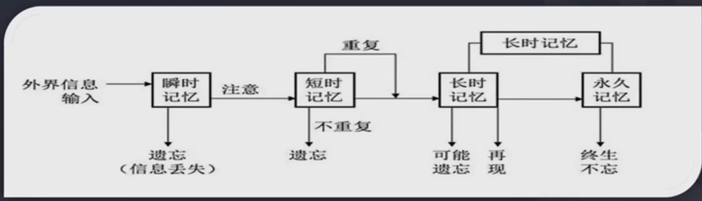

 
[视频地址 ](https://www.bilibili.com/video/BV1wA4y1S7DQ)

# 语言类的学习方法
1. 选择优秀的文章背诵，具有永久价值、不枯燥，历久弥新
2. 拆成单个句子，复杂的句子拆分成短句
3. 循环往复、循序渐进背诵、默写
4. 理解文章的含义
5. 背诵下一句前，把以往所学背诵一边，遇到卡顿错漏重复背诵
6. 直到这些文章成为自己身体的一部分，随意调遣使用

# 理工科的学习方法
1. 基本概念定义背熟
2. 能独立推到出来的一切可以推到的，独立推到熟练
3. 相关感悟、弄懂的题目装进进步本
4. 反复重做、标注，达到不忘，熟练
5. 回环往复循序渐进，用前面的知识理解后面的，反之亦然，融汇贯通

# 康奈尔笔记法

## 笔记的组成有如下

### 主栏（记录）- Record
读书听课记录尽可能丰富的信息

### 副栏（简化）-Reduce
简单的抽象 归纳 概括
通过副栏信息对主栏内容背诵，复习主栏复现所学

### 思考-Reflect
想法 感悟 体会 未解决的问题 的记录

## 笔记的使用方法

### 背诵-Recite
把主栏遮住，只用副栏复现所学

### 复习-Review
每周花十分钟左右时间，快速复习笔记

